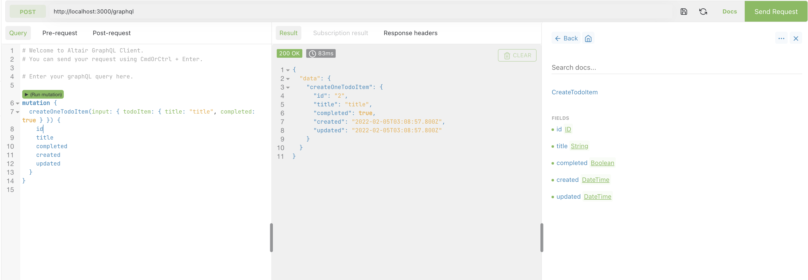
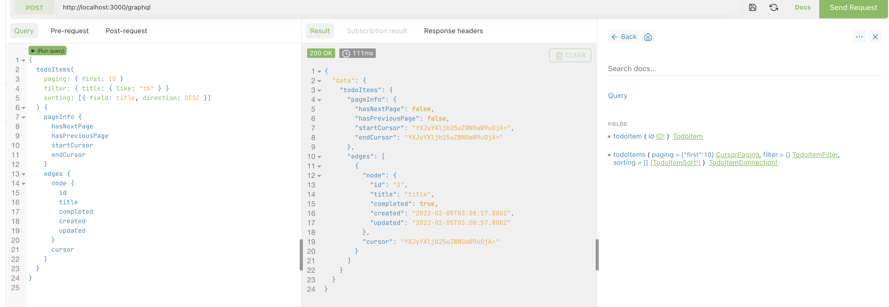

# API 기본구성

nestjs + nestjs-query + typeorm + postgresql

## Quick install

```bash
# nest project start
npm i -g @nestjs/cli
nest new nq-example
cd nq-example

# install nestjs-query
npm i @nestjs-query/core @nestjs/common class-transformer
npm i @nestjs-query/query-graphql @nestjs/common @nestjs/graphql graphql graphql-subscriptions class-transformer class-validator dataloader
npm i @nestjs-query/query-typeorm @nestjs/common @nestjs/typeorm class-transformer typeorm

# nestjs extra dependency install
npm i pg apollo-server-express
```

## Turtorial

### Todi-item Moudle, Entity, Dto 생성

```bash
nest g mo todo-item
nest g cl todo-item.entity todo-item
npx nest g cl todo-item.dto todo-item
```

### todo-item.dto.ts 내용물 수정

```tsx
import { FilterableField, IDField } from '@nestjs-query/query-graphql';
import { ObjectType, GraphQLISODateTime, Field, ID } from '@nestjs/graphql';

@ObjectType('TodoItem')
export class TodoItemDTO {
  @IDField(() => ID)
  id!: number;

  @FilterableField()
  title!: string;

  @FilterableField()
  completed!: boolean;

  @Field(() => GraphQLISODateTime)
  created!: Date;

  @Field(() => GraphQLISODateTime)
  updated!: Date;
}
```

### todo-item.entity.ts 내용물 수정

```tsx
import {
  Column,
  CreateDateColumn,
  Entity,
  PrimaryGeneratedColumn,
  UpdateDateColumn,
} from 'typeorm';

@Entity()
export class TodoItemEntity {
  @PrimaryGeneratedColumn()
  id!: string;

  @Column()
  title!: string;

  @Column()
  completed!: boolean;

  @CreateDateColumn()
  created!: Date;

  @UpdateDateColumn()
  updated!: Date;
}
```

### todo-item.module.ts 내용물 수정

```tsx
import { NestjsQueryGraphQLModule } from '@nestjs-query/query-graphql';
import { NestjsQueryTypeOrmModule } from '@nestjs-query/query-typeorm';
import { Module } from '@nestjs/common';
import { TodoItemDTO } from './todo-item.dto';
import { TodoItemEntity } from './todo-item.entity';

@Module({
  imports: [
    NestjsQueryGraphQLModule.forFeature({
      // import the NestjsQueryTypeOrmModule to register the entity with typeorm
      // and provide a QueryService
      imports: [NestjsQueryTypeOrmModule.forFeature([TodoItemEntity])],
      // describe the resolvers you want to expose
      resolvers: [{ DTOClass: TodoItemDTO, EntityClass: TodoItemEntity }],
    }),
  ],
})
export class TodoItemModule {
}
```

### AppMoudle 추가

```bash
import { Module } from '@nestjs/common';
import { GraphQLModule } from '@nestjs/graphql';
import { TypeOrmModule } from '@nestjs/typeorm';
import { AppController } from './app.controller';
import { AppService } from './app.service';
import { TodoItemModule } from './todo-item/todo-item.module';

@Module({
  imports: [
    TypeOrmModule.forRoot({
      type: 'postgres',
      database: 'gettingstarted',
      username: 'gettingstarted',
      autoLoadEntities: true,
      synchronize: true,
      logging: true,
    }),
    GraphQLModule.forRoot({
      // set to true to automatically generate schema
      autoSchemaFile: true,
    }),
    TodoItemModule,
  ],
  controllers: [AppController],
  providers: [AppService],
})
export class AppModule {}
```

### docker-compose.yml 추가

```yaml
version: "3"

services:
  postgres:
    image: "postgres:11.5"
    environment:
      - "POSTGRES_USER=gettingstarted"
      - "POSTGRES_DB=gettingstarted"
    expose:
      - "5432"
    ports:
      - "5432:5432"
```

### Start

```yaml
docker-compose up -d
npm start
```

## Conclusion





## Etc - entity(dto + entity)

```tsx
import {
  Column,
  CreateDateColumn,
  Entity,
  PrimaryGeneratedColumn,
  UpdateDateColumn,
} from 'typeorm';
import { Field, GraphQLISODateTime, ID, ObjectType } from '@nestjs/graphql';
import { FilterableField, IDField } from '@nestjs-query/query-graphql';

@ObjectType('TodoItem')
@Entity()
export class TodoItemEntity {
  @IDField(() => ID)
  @PrimaryGeneratedColumn()
  id!: string;

  @FilterableField()
  @Column()
  title!: string;

  @FilterableField()
  @Column()
  completed!: boolean;

  @Field(() => GraphQLISODateTime)
  @CreateDateColumn()
  created!: Date;

  @Field(() => GraphQLISODateTime)
  @UpdateDateColumn()
  updated!: Date;
}
```
